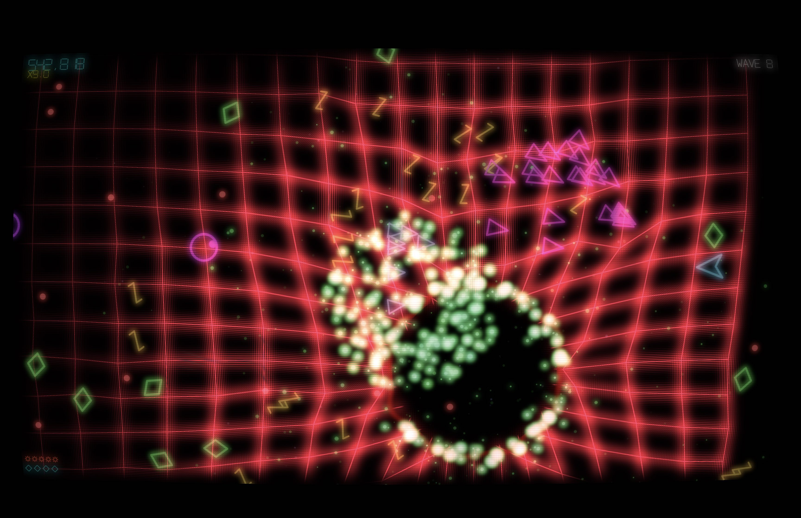

# Vektrix

A psychedelic twin-stick shooter built with WebGPU. Pure survival, relentless pressure, banging music.

## [▶ Play Now](https://vektrix.space)

## [🎬 Watch Trailer](https://youtu.be/j_NAdKGNEd8)

## About

Vektrix is a browser-based twin-stick shooter inspired by Jeff Minter games and Geometry Wars but with a singular design focus: relentless pressure. Everything that paused the action or distracted from the core loop was cut. What remains is pure survival against waves of enemies, spawners, and smart bombs.

Built in two days with AI assistance.

## Features

- **WebGPU rendering** — Modern GPU API for smooth performance
- **GPU compute particles** — 100,000+ particles updated entirely on the GPU
- **Deformable grid** — Mass-spring simulation that reacts to gameplay
- **Bloom and post-processing** — That classic vector glow aesthetic

## Controls

| Input | Action |
|-------|--------|
| WASD / Left Stick | Move |
| Mouse / Right Stick | Aim |
| Click | Fire (mouse) |
| Right Stick | Aim + Auto-Fire (gamepad) |
| Space / LB | Smart Bomb |

## Tech

- TypeScript
- WebGPU + WGSL compute shaders
- Vite

## Read More

[Building a WebGPU Twin-Stick Psychedelic Shooter](https://www.jamesdrandall.com/posts/building-a-webgpu-twinstick-psychedelic-shooter/) — design decisions, technical deep-dives, and what got cut.

## License

MIT

Music sourced from [Pixabay](https://pixabay.com) and used under the [Pixabay Content License](https://pixabay.com/service/license-summary/).